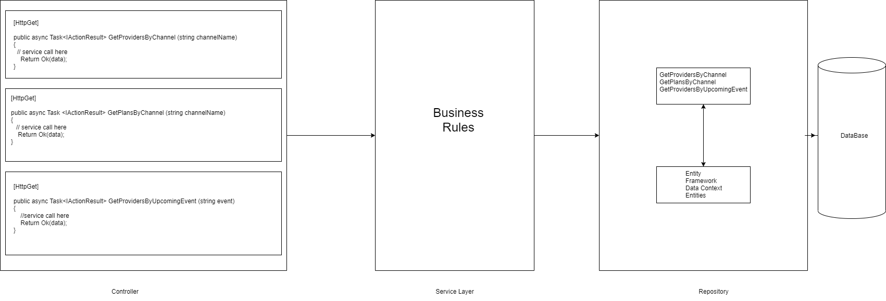

# FlixedQuestions
 Flixed Challenge

# Part 1 : Structure API EndPoints
How would you structure classes in your code to be able to implement these endpoints?  We expect to need to add endpoints or extend existing endpoints in the future to be able to help users with more questions.  We expect the content of the database to change often but not the structure.

I will use the following class designs that will allow the application layers to be extended and reusable:

Explain your class structure: what factors did you weigh, what tradeoffs did you consider, etc.

For small applications the attached design adds additional complexity due to the nature of adding abstraction layers, however 
the design will allow for extensibility and scalability. 

# Part 2: Prioritize for demo
What features would you want to complete for the demo and in what order would you prioritize those features? Why?

# Two Weeks
1.The structure of the API to allow for new endpoints and extending existing ones should be priority because architecture should be the first step.\
2.Assuming interal developers require technical information , then that should be next priority to add more features. \
3.The ability to communicate high level information about the API will be done after as to get ready for meeting with clients. \
4.Following the ability to communicate high level information, a contact page will be required to accompany. \
5.Finally the last feature of the two weeks should be page to be visually polished to be presented to clients.

# Month
6.Developers should have ability to make requests in page for ease of usage \
7.Api documentation should be searchable (interchangeable with priority #6) with same reason being ease of usage \
8.Finally adding multiple language support is lowest priority for first version as its not necessary for developers and clients

# Tools to be Considered

Swagger Link : 
[Swagger](https://petstore.swagger.io/)

Implementing Swagger an out of the box solution would allow for several features to be accessible, Swagger will enable the following
requirements right away : page to be visually polished, API documentation to be searchable, relatively easy to add new endpoints and
developers will be able to make requests directly in the page with API key.The priority System will then be making sure developers 
have all the technical information they need to add features which will be relatively easy with Swagger,  building ontop of Swagger
to enable high level information about API for non-technical and finally a contact page for prospective users to get in contact 
and/or request API keys.

One Month : 
Finally enabling Api for multiple languages will be an ongoing process in the second half.

# Part 3 : Explain in your own words   
Flexbox is designed for layout in one dimension (row or column). Grid is designed for two-dimensional layout - rows and columns 
at same time. A general idea is when you need to control row or column use flexbox and when you need to use both row and column
use grid. Many modern css frameworks use flexbox under the hood.